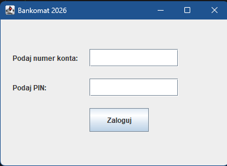
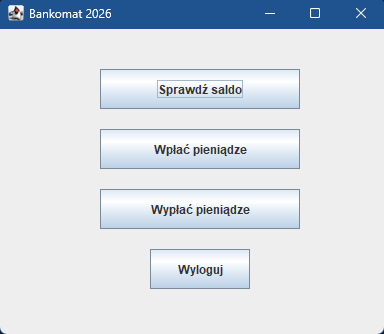
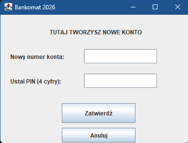

# 🏦 Java ATM: From Terminal to GUI

Projekt edukacyjny rozwijany w ramach ścieżki **Junior Java Developer 2026**. Aplikacja pokazuje ewolucję systemu bankomatowego – od prostego skryptu w konsoli po pełnoprawny interfejs graficzny (GUI) z trwałym zapisem danych.

---

## 🚀 Kluczowe Funkcjonalności

### 🔐 System Dostępu i Bezpieczeństwa
- **Logowanie:** Weryfikacja numeru konta i 4-cyfrowego kodu PIN.
- **Rejestracja:** Możliwość założenia nowego konta z poziomu okna aplikacji.
- **Walidacja danych:** System automatycznie sprawdza unikalność numeru konta (brak duplikatów) oraz poprawność formatu PIN (blokada liter i błędnej długości).

### 💸 Operacje Bankowe
- **Zarządzanie środkami:** Wpłaty, wypłaty oraz sprawdzanie salda w czasie rzeczywistym.
- **Ochrona przed debetem:** Logika blokująca wypłaty przekraczające stan konta.
- **Trwałość danych:** Każda operacja (wpłata/wypłata/nowe konto) jest natychmiast zapisywana w pliku tekstowym.

---

## 📸 Prezentacja Projektu

| Ekran Logowania | Menu Główne | Ekran Rejestracji |
| :---: | :---: | :---: |
|  |  |  |

---

## 🛠️ Stack Technologiczny
- **Język:** Java 17+
- **Interfejs:** Java Swing / AWT (Graficzny), Scanner (Terminalowy)
- **Baza danych:** System plików Java I/O (Scanner, PrintWriter)
- **Kontrola wersji:** Git / GitHub

## 📁 Przechowywanie Danych
Aplikacja korzysta z pliku `baza_kont.txt`. Dane są strukturyzowane w formacie tekstowym z separatorem średnika:
`numer_konta;pin;saldo`
*Przykład: 12345;1111;5000*

---

## 🏁 Jak uruchomić?
1. Sklonuj repozytorium:
   ```bash
   git clone [https://github.com/Nikodem-Stasiak/MiniProjekt_Bankomat.git](https://github.com/Nikodem-Stasiak/MiniProjekt_Bankomat.git)

📈 Roadmap (Plany na 2026)
* [x] Implementacja GUI (Swing)

* [x] System rejestracji i walidacji

* [ ] Refaktoryzacja do wzorca MVC (Model-View-Controller)

* [ ] Migracja na bazę danych SQL (H2 lub MySQL)

* [ ] Dodanie historii transakcji dla każdego użytkownika

Autor: Nikodem Stasiak

Projekt rozwijany z pasją do czystego kodu.
